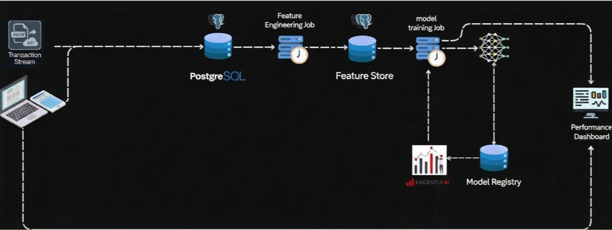

# Fraud Detection System

A production-ready machine learning pipeline for real-time credit card fraud detection, featuring automated data drift monitoring, model retraining workflows, and comprehensive observability.

---

## Table of Contents

- [Overview](#overview)
- [System Architecture](#system-architecture)
- [Data Pipeline](#data-pipeline)
- [Features](#features)
- [Tech Stack](#tech-stack)
- [Getting Started](#getting-started)
- [API Reference](#api-reference)
- [Monitoring &amp; Observability](#monitoring--observability)
- [Model Retraining](#model-retraining)
- [Dataset](#dataset)

---

## Overview

This system implements a robust fraud detection engine that processes credit card transactions in real-time, leveraging historical user behavior patterns and geospatial analysis to identify anomalous activities. The architecture separates inference and training workflows, enabling continuous model improvement while maintaining low-latency predictions.

### Key Capabilities

- **Real-time Inference**: Sub-second fraud scoring for incoming transactions
- **Behavioral Analytics**: Rolling window calculations (1h, 24h, 100 transactions) per user
- **Geospatial Fraud Detection**: Distance calculations between user and merchant locations
- **Automated Drift Detection**: Statistical monitoring of feature distributions
- **Continuous Training**: Airflow-orchestrated retraining on drift triggers

---

## System Architecture

> **[Insert System Design Diagram Here]**
>
> _Add your architecture diagram to the repository and update the path below:_
>
> 

The system comprises two primary workflows:

| Component              | Purpose                           | Technology                               |
| ---------------------- | --------------------------------- | ---------------------------------------- |
| **Inference Pipeline** | Real-time fraud scoring           | FastAPI, PostgreSQL, Custom Transformers |
| **Training Pipeline**  | Model retraining & drift handling | Apache Airflow, MLflow, Evidently AI     |

---

## Data Pipeline

### Input Schema

Transactions arrive as JSON requests with the following structure:

```json
{
  "cc_num": "1234567890123456",
  "trans_date_trans_time": "2021-04-12 14:23:45",
  "category": "grocery_pos",
  "amt": 127.5,
  "lat": 40.7128,
  "long": -74.006,
  "merch_lat": 40.7589,
  "merch_long": -73.9851,
  "is_fraud": 0
}
```

### Feature Engineering Pipeline

| Transformation           | Description                          | Output Features                                                                                                      |
| ------------------------ | ------------------------------------ | -------------------------------------------------------------------------------------------------------------------- |
| **Temporal Aggregation** | Rolling statistics over user history | `last_1h_count`, `last_1h_sum`, `last_1h_mean`, `last_24h_count`, `last_24h_sum`, `last_24h_mean`, `last_100_median` |
| **Geospatial Analysis**  | Haversine distance calculations      | `distance_last_tx`, `distance_current_tx`, `avg_user_merchant_distance`                                              |
| **Temporal Encoding**    | Time-of-day categorization           | `partofday_morning`, `partofday_afternoon`, `partofday_evening`                                                      |
| **Categorical Encoding** | Merchant category one-hot encoding   | `category_*` (binary flags per category)                                                                             |
| **Recency Feature**      | Time since last transaction          | `time_since_last_tx`                                                                                                 |

### Database Schema

**Transaction History Table**

- Stores raw incoming transactions for user history queries
- Indexed by `cc_num` and `trans_date_trans_time`

**Feature Lake**

- Stores transformed features for model retraining
- Foreign key relationship to dates table via `date_index`

**Dates Dimension Table**

- Facilitates time-based querying for batch retraining jobs

---

## Features

### Core Detection Logic

- **Rolling Aggregates** : Computes sum, count, and average over the last 1 hour and 24 hours, plus median over the last 100 transactions per credit card.
- **Distance Calculations** : Averages distances between user and merchant for overall, previous, and current transactions.
- **Time Zoning** : Categorizes the transaction time into morning, afternoon, or evening to detect unusual activity periods.
- **One-Hot Encoding** : Encodes merchant categories to identify deviations from typical spending patterns.

### Machine Learning Models

| Model                        | Type                           | Use Case                      |
| ---------------------------- | ------------------------------ | ----------------------------- |
| **Random Forest Classifier** | Supervised ensemble            | Primary fraud scoring         |
| **Isolation Forest**         | Unsupervised anomaly detection | Novel fraud pattern detection |

---

## Tech Stack

### Core Infrastructure

- **PostgreSQL**: Transaction history and feature storage
- **Redis**: Caching layer for frequent user profiles
- **FastAPI**: High-performance inference API

### ML Operations

- **MLflow**: Experiment tracking, model registry, and artifact storage
- **Apache Airflow**: Orchestration of drift detection and retraining workflows
- **Evidently AI**: Statistical drift detection and data quality monitoring

### Observability

- **Grafana**: Real-time dashboards for business metrics and system health
- **Prometheus**: Metrics collection and alerting

---

## Getting Started

### Prerequisites

```bash
Prerequisites
Docker 20.10+
Docker Compose 2.0+
Python 3.10+ (for local development)
```

### Installation

### Docker Deployment (Recommended)

```bash
# Clone repository
git clone https://github.com/AhmedMaherTohmay/fraud-detection.git
cd fraud-detection

# Configure environment
cp .env.example .env
# Edit .env with your database credentials

# Build and start services
docker build -t fraud-detection .
docker run -p 5000:5000 fraud-detection
```

### Local Development Setup

```bash
# Clone repository
git clone https://github.com/yourusername/fraud-detection-system.git
cd fraud-detection-system

# Install dependencies
pip install -r requirements.txt

# Configure environment variables
cp .env.example .env
# Edit .env with your database credentials

#Run the Service
python src/main/app.py
```

### Running the Inference Service

```bash
# Start API server
uvicorn src.api.main:app --host 0.0.0.0 --port 8000

# test api
curl -X POST http://127.0.0.1:5000/predict \
     -H "Content-Type: application/json" \
     -d @test_data.json
```

---

## API Reference

### POST /predict

Submit a transaction for fraud scoring.

**Request:**

```json
{
  "cc_num": "4532015112830366",
  "trans_date_trans_time": "2023-11-15 09:23:11",
  "category": "shopping_net",
  "amt": 299.99,
  "lat": 34.0522,
  "long": -118.2437,
  "merch_lat": 37.7749,
  "merch_long": -122.4194
}
```

**Response:**

```json
{
  "transaction_id": "tx_8f3a9b2c",
  "fraud_probability": 0.0234,
  "is_fraud": false,
  "model_version": "rf_v2.1.3",
  "features_used": {
    "last_1h_count": 2,
    "last_24h_sum": 450.0,
    "distance_current_tx": 347.2,
    "partofday_morning": 1
  }
}
```

## Monitoring & Observability

### Grafana Dashboards

Access dashboards at `http://localhost:3000`

| Dashboard             | Metrics                                                       |
| --------------------- | ------------------------------------------------------------- |
| **Fraud Overview**    | Transaction volume, fraud rate, model confidence distribution |
| **Model Performance** | Precision, recall, latency percentiles                        |
| **Data Drift**        | Feature distribution shifts, PSI scores                       |
| **System Health**     | API latency, database connections, error rates                |

### Key Alerts

- **Drift Detected**: Triggers when PSI > 0.2 for critical features (amt, distance)
- **Model Degradation**: F1-score drop > 5% over 24h window
- **High Latency**: p99 inference time > 500ms
- **Data Quality**: Missing value rate > 1%

---

## Model Retraining

### Retraining Flow

1. **Drift Detection** (Airflow DAG: `drift_monitor`)
   - Runs hourly statistical tests on `amt` and other critical features
   - Generates Evidently AI reports
   - Triggers retraining on significant drift

2. **Data Preparation**
   - Extracts features from Feature Lake based on `date_index`
   - Applies identical transformations as inference pipeline

3. **Model Training**
   - Trains both Random Forest and Isolation Forest
   - Hyperparameter tuning via Optuna
   - Registers best model to MLflow Model Registry

4. **Deployment**
   - A/B testing setup for new models
   - Gradual traffic shifting
   - Automatic rollback on performance degradation

---

## Dataset

**Source**: [Credit Card Transactions Fraud Detection Dataset](https://www.kaggle.com/datasets/kartik2112/fraud-detection) (Kaggle)

| Attribute      | Value                     |
| -------------- | ------------------------- |
| **Size**       | 1M+ transactions          |
| **Users**      | 1,000 customers           |
| **Merchants**  | 800 merchants             |
| **Time Span**  | 2019-2021                 |
| **Geography**  | United States             |
| **Fraud Rate** | ~0.5% (highly imbalanced) |

### Limitations & Mitigations

| Limitation     | Impact                                      | Mitigation Strategy                                                                       |
| -------------- | ------------------------------------------- | ----------------------------------------------------------------------------------------- |
| Synthetic data | May not capture real-world fraud patterns   | Extensive feature engineering focusing on behavioral anomalies                            |
| 2-year window  | Seasonal patterns limited                   | Generalized time features (part of day) rather than month-specific                        |
| US-only        | Geographic features not globally applicable | Latitude/longitude used without regional assumptions; pipeline accepts global coordinates |

---

## License

MIT License - see [LICENSE](LICENSE) for details.

---

## Contact

For questions or support, please open an issue or contact the maintainers at [your-email@domain.com].
